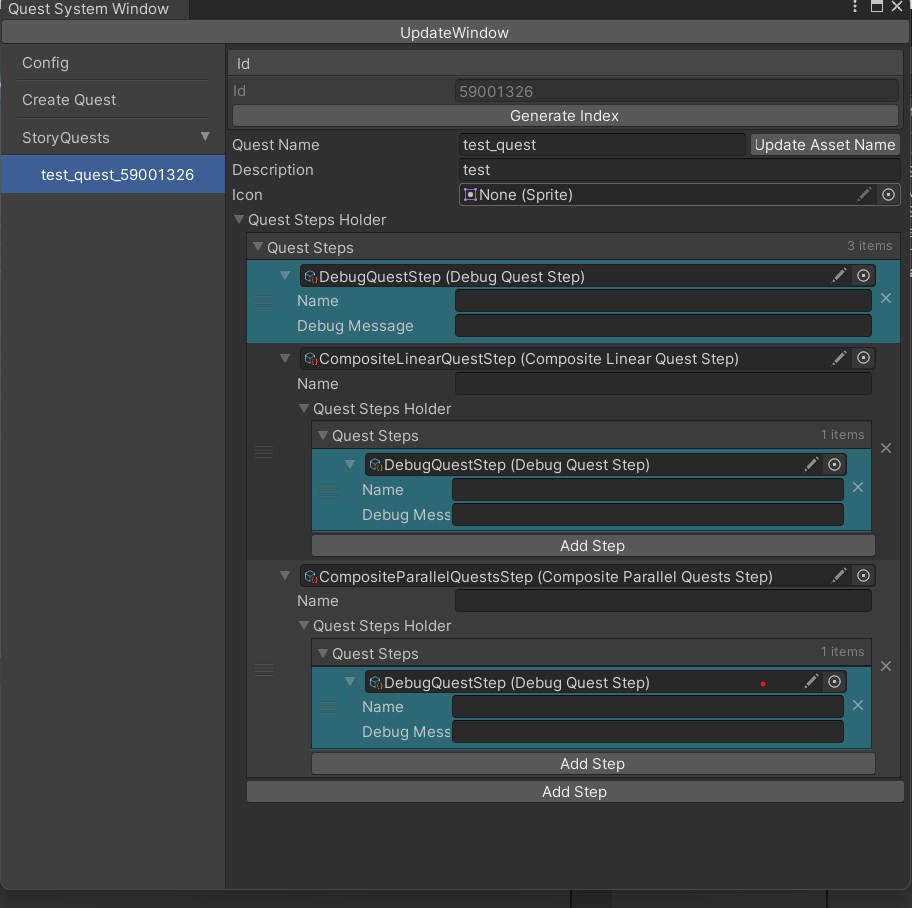
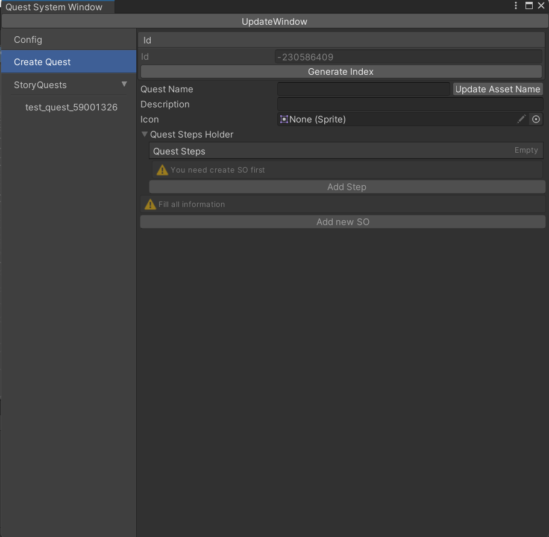
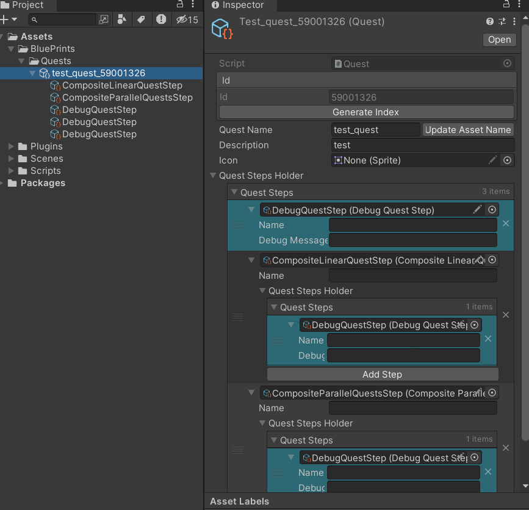

"# QuestManager" 

В примере имеются только 3 базовые ноды:
<ul>
<li>DebugQuestStop</li>
<li>CompositeLinearStep(Пример: показать катсцену, подойти к персонажу, запустить катсцену)</li>
<li>CompositeParallelStep(Пример: параллельно надо найти 3 шкуры и 3 древесины</li>
</ul>

Создание нового квеста

Каждый QuestStep это ScriptableObject, спавнящийся дочерним объектом у Quest, чтобы не плодить большое количество SO в проекте и получить удобную сериализацию данных

